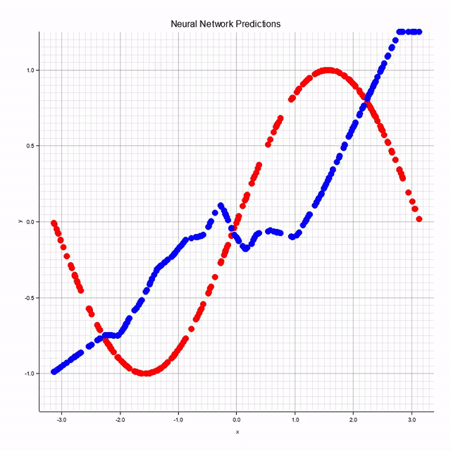
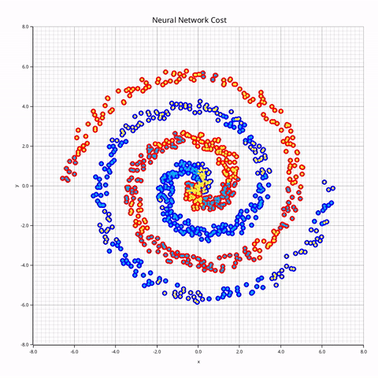

# Rust Neural Network Library

A simple neural network library written in Rust, designed for learning, experimentation, and building small AI systems from scratch. 
Includes training utilities, activation functions, and example projects.

## Features

- Fully implemented feedforward neural networks
- Backpropagation with gradient descent
- Modular layer system
- Common activation functions (ReLU, Sigmoid, Tanh)
- CPU-based training (no external ML dependencies)
- Example binaries demonstrating learning tasks

## Getting Started

### Clone the repository

```bash
git clone https://github.com/SpaceByteStudios/NeuralNetworkRust.git
cd NeuralNetworkRust
cargo build --release

#Build just the Library
cargo build --release --lib
```


## Running Examples

This project includes several demo binaries located in `src/bin/`.

```bash
cargo run --bin demo_xor
cargo run --bin demo_graph
cargo run --bin demo_spiral
cargo run --bin demo_mnist
```

Videos of the Neural Network learning regression and classification:

<p>
  
  
</p>

## Usage as a Library

Add this to your `Cargo.toml`:

```toml
[dependencies]
nn_rust = { path = "../NeuralNetworkRust" }
```

Example code:

```bash
use nn_rust::neural_net::{
    functions::{Activation, OutputActivation},
    matrix::Vector,
    network::Network,
};


fn main() {
  let input: Vector = Vector::new(vec![0.0, 1.0]);

  //Specify Network
  let layers_sizes: Vec<usize> = vec![2, 2, 2];
  let activation: Activation = Activation::ReLu;
  let out_activation: OutputActivation = OutputActivation::Linear;

  //Create Neural Network
  let mut network: Network = Network::new(layers_sizes, activation, out_activation);

  let output: Vector = network.calc_network(&input);
  println!("{:?}", output);
}
```

## Motivation

This project was built to deeply understand how neural networks work under the hood, including forward propagation, backpropagation, and optimization without relying on high-level ML frameworks.
<p>
I really recommend giving this playlist from 3Blue1Brown a watch if you also want to learn how Neural Networks work:

https://youtu.be/aircAruvnKk?si=a9To1nigVJxqqfbY
</p>
